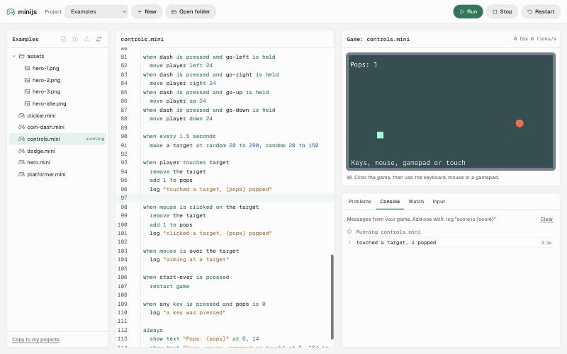

# minijs

The easiest rules-based 2D game engine, built in JavaScript.

You write a game as plain sentences in a `.mini` file: what things look like, and a list of `when ... ` rules. No brackets, no semicolons, and when something is wrong minijs tells you what to do in plain words ("I don't know what "cion" is. Did you mean "coin"?").

```
game
  size 320 by 180
  background sky blue
  gravity 0.4

thing player
  looks like orange box 12 by 16
  starts at 40, 100
  solid
  falls

thing ground
  looks like seagreen box 640 by 20
  starts at 0, 160
  solid
  fixed

when right key is held
  move player right 2

when up key is pressed and player is on ground
  push player up 7
```



## Try it

Needs Node 20 or newer.

```bash
npm install
npm run dev
```

Open the address it prints. You get three columns:

- **Files** on the left. Pick a project at the top: the built-in Examples, projects kept in this browser (**New**), or a real folder on your computer (**Open folder**, in Chrome and Edge). Make files and folders, rename them (double-click or F2), drag them into folders, delete them, and drop pictures in from your computer.
- **The open file** in the middle. Game files restart the game as you type. Pictures show a preview and the line to use them.
- **The game** on the right, and under it four tabs: **Problems** (click one to jump to the line), **Console** (lines from `log "..."` and game events), **Watch** (live numbers and how many of each thing exist) and **Input** (keys, mouse, gamepads and controls as the game sees them).

Click the game, then play with the keyboard, mouse or a gamepad. Ctrl+S or Cmd+S saves and runs. Everything saves on its own.

Other commands:

| Command | What it does |
|---|---|
| `npm test` | Runs every test, including all the example games |
| `npm run bench` | Speed check: 2,000 moving things per tick |
| `npm run build` | Builds the playground into `playground/dist` as static files |
| `npm run site:build` | Builds the complete website, Studio, and all three playable games into `site/dist` |
| `npm run preview -w site` | Previews the complete website after a site build |
| `node scripts/make-example-assets.mjs` | Redraws the hero pictures in `examples/assets` |

Vercel builds are configured in `vercel.json`. The repository-root deployment
runs `npm run site:build` and publishes `site/dist`. Projects whose Root Directory
is `site` use `site/vercel.json`; enable access to files outside that directory
so the build can include the sibling Studio, language, runtime, and example workspaces.
The site workspace's `npm run build` also builds the complete website from a clean checkout.

To deploy Studio independently, import this repository as a second Vercel project
with Root Directory `playground` and access to files outside that directory enabled.
`playground/vercel.json` installs the repository's dependencies, builds Studio,
and publishes `playground/dist`. After deploying, add these rules to the main
site's `vercel.json`, replacing `YOUR-STUDIO-PROJECT.vercel.app` with the second
project's stable production hostname:

```json
{
  "redirects": [
    { "source": "/studio", "destination": "/studio/", "permanent": true }
  ],
  "rewrites": [
    {
      "source": "/studio/:path*",
      "destination": "https://YOUR-STUDIO-PROJECT.vercel.app/:path*"
    }
  ]
}
```

Merge these fields with the existing build settings. The rewrite forwards Studio
pages, assets, manifest, and service worker while preserving `/studio/` in the
browser. Its current relative Vite base supports both the direct project URL and
the proxied path. Cloudflare DNS continues to point the domain at the main
Vercel project; path routing happens in Vercel.

## Examples

| File | Shows |
|---|---|
| [`platformer.mini`](examples/platformer.mini) | Jumping, gravity, collecting coins, camera |
| [`coin-dash.mini`](examples/coin-dash.mini) | Top-down movement, patrolling enemies, lives |
| [`dodge.mini`](examples/dodge.mini) | Falling rocks, random spawns, leaving the screen |
| [`clicker.mini`](examples/clicker.mini) | Clicking on things, counters, buying upgrades |
| [`hero.mini`](examples/hero.mini) | Pictures and walk animation |
| [`controls.mini`](examples/controls.mini) | Keyboard, mouse buttons, gamepads, sticks, touch buttons, controls, `log` |

## The language in one page

The full reference is [`docs/spec.md`](docs/spec.md). Lines are indented to show what belongs to what. `#` starts a note to yourself. Upper or lower case does not matter. `a`, `an` and `the` are optional in most places.

### Blocks

| Line | Meaning |
|---|---|
| `game` | Settings: `size 480 by 270`, `pixel art`, `background navy`, `gravity 0.4`, `touch buttons` |
| `score starts at 0` | A number the game keeps track of |
| `thing coin` | A kind of thing. Lines under it say how it looks and acts |
| `control jump` | One action from many inputs. Lines under it: `space key`, `gamepad a`, `right mouse` |
| `when <something happens>` | A rule. The indented lines under it are what to do |
| `always` | A rule that runs every moment |

### Things

| Line | Meaning |
|---|---|
| `looks like gold circle 4` | Also `red box 12 by 16`, or a picture: `looks like "hero.png"` |
| `animation walk "a.png", "b.png" at 8 fps` | Pictures to flip through |
| `starts at 40, 100` | One copy appears here at the start. Repeat for more copies |
| `size 16 by 16` | Override the size |
| `solid` | Other solid things can't pass through it |
| `fixed` | Never pushed around |
| `falls` | Pulled down by gravity |
| `camera follows` | The screen follows it |

Colors are any web color name (`red`, `sky blue`, `dark slate gray`) or `#ff8800`.

### When

| Rule | Happens |
|---|---|
| `when game starts` | Once, at the start |
| `when space key is pressed` | Also `is held` (every moment) and `is released`. `any key` works too |
| `when mouse is clicked` | Also `right mouse`, `middle mouse`, `is held`, `is released`, and `on the button` |
| `when gamepad a is pressed` | Gamepad 1. Also `gamepad 2 start`, and every state |
| `when jump is pressed` | A `control`, so keyboard, gamepad and mouse all work |
| `when player touches coin` | While they overlap. `coin` means the coin that was touched |
| `when rock leaves the screen` | Once, when it goes fully off screen |
| `when every 2 seconds` | Repeats |
| `when after 5 seconds` | Once |
| `when score is 10` | Once each time this becomes true |

Add a condition to any of them: `when up key is pressed and player is on ground`.

Keys: `left right up down space enter shift escape tab backspace delete ctrl alt`, letters `a` to `z`, digits `0` to `9`, or `any`.

Gamepad buttons: `a b x y lb rb lt rt select start ls rs up down left right` (the last four are the d-pad). Combos use `and`: `when s key is pressed and ctrl key is held`. To let two different inputs do the same thing, make a `control`.

`touch buttons` in the game block shows arrows plus A and B on phones: the arrows press the arrow keys, A presses space, B presses enter.

### Conditions

`score is 10`, `lives is not 0`, `player x is above 100` (also `more than`, `greater than`), `score is below 3` (also `less than`), `player is on ground`, `left key is held`, `mouse is held`, `mouse is over the button`, `gamepad a is held`, `jump is held`. Join them with `and`, `or`, `not`.

### Numbers

`12`, `score`, `player x` (also `y`, `vx`, `vy`, `width`, `height`), `count of coin`, `mouse x`, `gamepad stick x` (from -1 to 1; also `right stick y`, `gamepad 2 stick x`), `random 1 to 6`, and `+ - * /` with spaces around them (`score - 1`).

### Actions

| Action | Does |
|---|---|
| `move player left 2` | Moves now, stopped by solid things |
| `push player up 7` | Adds speed in that direction |
| `stop player` | Sets its speed to 0 |
| `set score to 0` | Changes a number |
| `set player x to 40` | Also `y`, `vx`, `vy` |
| `add 1 to score` / `subtract 1 from lives` | Changes a number |
| `make a coin at 100, 40` | Adds a new copy |
| `remove the coin` | Takes it away |
| `change player to look like red box 4 by 4` | New look |
| `play walk on player` / `stop animation on player` | Animations |
| `show text "Score: {score}" at 4, 4 in yellow` | Text on screen. `{...}` shows a number |
| `log "score is {score}"` | A line in the playground's Console tab |
| `stop game` / `restart game` | Freeze, or start over |

## How it fits together

```
packages/lang      compile(source) -> { program, errors }. Plain JavaScript, no browser needed.
packages/runtime   start(program, canvas) runs it. Also runs headless for tests.
playground         The page above: file browser, CodeMirror editor, live game, Problems/Console/Watch/Input.
examples           Sample games, all tested.
```

```js
import { compile } from '@minijs/lang'
import { start } from '@minijs/runtime'

const { program, errors } = compile(source)
if (program) await start(program, canvas, { assetsBase: '/assets/' })
```

Design and plans live in [`docs/spec.md`](docs/spec.md) and [`docs/plans/`](docs/plans/). What comes next (offline Studio, desktop app, a flagship game) is in [`docs/plans/roadmap-stages-5-7.md`](docs/plans/roadmap-stages-5-7.md).

## License

Apache 2.0. See [LICENSE](LICENSE).
