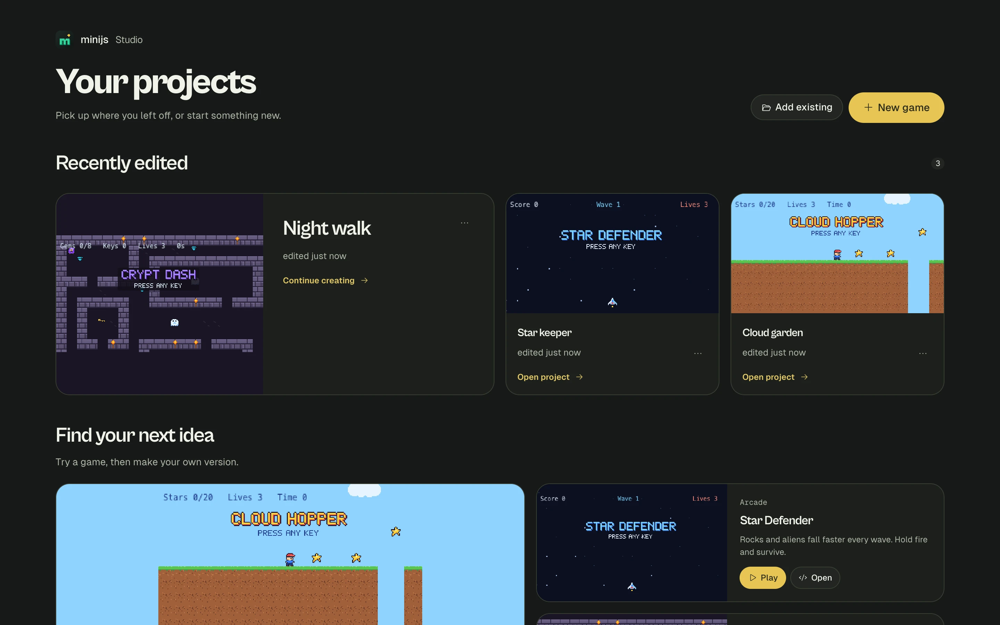

# minijs

**Make 2D games by writing plain sentences.** No coding experience needed.

You describe what's in your game and what should happen, in words like these:

```mini
game
  size 320 by 180
  background sky blue
  gravity 0.4

thing player
  looks like orange box 12 by 16
  starts at 40, 100
  solid
  falls

thing ground
  looks like sea green box 640 by 20
  starts at 0, 160
  solid
  fixed

when right key is held
  move player right 2

when up key is pressed and player is on ground
  push player up 7
```

That's a complete game: a box that runs and jumps. No brackets, no semicolons. When something is wrong, minijs tells you in plain words what to do:

> I don't know what "cion" is. Did you mean "coin"?



## Start making games

- **[Open Studio in your browser](https://minijs.ambytion.net/studio/)**. Nothing to install.
- **[Download the desktop app](https://github.com/ambytionhq/minijs/releases/latest)** for Mac, Windows and Linux.

Then follow **[Getting started](docs/getting-started.md)** to build your first game in about 15 minutes, or click **Start the tutorial** inside Studio.

## What you can make

Platformers, top-down adventures, arcade shooters, clicker games and more. Games can use:

- Shapes or your own pictures, with animations
- Gravity, jumping, solid walls and platforms
- Keyboard, mouse, gamepads (up to four players) and on-screen buttons for phones
- Scores, lives, timers and random numbers
- Levels drawn with letters
- A camera that follows the player

When it's done, share a link, download it as one `.html` file that plays in any browser, or (in the desktop app) export it as an app of its own.

## Documentation

| Page | What's in it |
|---|---|
| [Getting started](docs/getting-started.md) | Your first game, step by step |
| [How do I...?](docs/recipes.md) | Copy-and-paste answers: lives, enemies, shooting, timers, restart keys |
| [Language guide](docs/language.md) | Every word minijs understands |
| [Using Studio](docs/studio.md) | Files, pictures, sharing, exporting, the desktop app |
| [Fixing problems](docs/problems.md) | What each message means, and what to do when a game misbehaves |

## Examples

Open any of these from the Studio home page, or read them here.

| Game | Shows |
|---|---|
| [Cloud Hopper](examples/cloud-hopper/game.mini) | A full platformer with a level drawn from letters |
| [Star Defender](examples/star-defender/game.mini) | An arcade shooter |
| [Crypt Dash](examples/crypt-dash/game.mini) | A top-down adventure with keys, doors and ghosts |
| [platformer.mini](examples/basics/platformer.mini) | Jumping, gravity, collecting coins, camera |
| [coin-dash.mini](examples/basics/coin-dash.mini) | Top-down movement, patrolling enemies, lives |
| [dodge.mini](examples/basics/dodge.mini) | Falling rocks, random spawns, leaving the screen |
| [clicker.mini](examples/basics/clicker.mini) | Clicking on things, counters, buying upgrades |
| [hero.mini](examples/basics/hero.mini) | Pictures and walk animation |
| [controls.mini](examples/basics/controls.mini) | Keyboard, mouse, gamepads, sticks, touch buttons, controls, `log` |

## Working on minijs itself

See [CONTRIBUTING.md](CONTRIBUTING.md) for running it from source, tests, the engine API, deploying and releasing.

## License

Apache 2.0. See [LICENSE](LICENSE).
